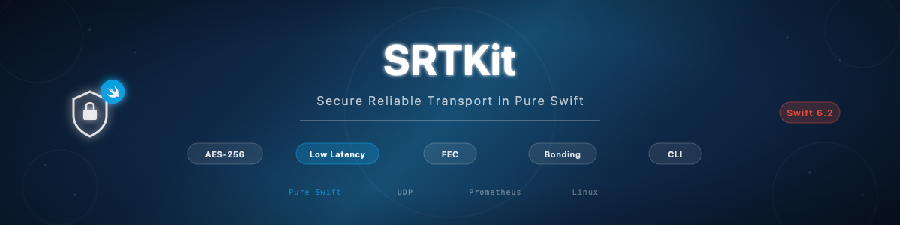

# swift-srt-kit

[](https://github.com/atelier-socle/swift-srt-kit/actions/workflows/ci.yml)
[](https://codecov.io/github/atelier-socle/swift-srt-kit)
[](https://atelier-socle.github.io/swift-srt-kit/documentation/srtkit/)


[](LICENSE)



Pure Swift implementation of the Secure Reliable Transport (SRT) protocol. UDP-based reliable, low-latency media transport with AES encryption, forward error correction, connection bonding, and real-time statistics. No C dependencies — this is NOT a libsrt wrapper. Strict `Sendable` conformance throughout. Part of the [Atelier Socle](https://www.atelier-socle.com) streaming ecosystem.

---

## Features

- **Caller/Listener/Rendezvous** — Three connection modes for any SRT topology with full handshake negotiation (induction, conclusion, cookie exchange)
- **AES-CTR + AES-GCM encryption** — End-to-end encryption with PBKDF2 key derivation (RFC 2898), RFC 3394 key wrap, configurable key sizes (128/192/256), and automatic key rotation with pre-announce
- **Forward Error Correction** — XOR-based row, column, and matrix FEC with staircase/even layouts, configurable ARQ modes (always, onreq, never), and `SRTO_PACKETFILTER` format parsing
- **Connection Bonding** — Broadcast (all links), main/backup (automatic failover), and balancing (weighted aggregate) groups with packet deduplication and stability monitoring
- **Congestion Control** — LiveCC (packet pacing), FileCC (AIMD with slow start), AdaptiveCC (pattern detection), pluggable architecture via `CongestionControllerPlugin` protocol
- **Bandwidth Probing** — Stepped probe engine with quick/standard/thorough presets, auto-configuration generation, and bitrate monitoring with hysteresis
- **TSBPD Timing** — Time-Based Sender/Buffer/Delivery with clock drift correction, too-late packet drop, and configurable latency
- **Real-time Statistics** — Comprehensive metrics (packets, bytes, RTT, bandwidth, buffers, congestion, FEC, encryption), quality scoring with 5 weighted metrics, Prometheus text exposition, and StatsD datagram export
- **Stream Recording** — Buffered recording with size/duration-based rotation in MPEG-TS or raw format
- **Access Control** — StreamID-based access control with `#!::` format parsing and generation (resource, mode, session, user, content type, custom keys)
- **Auto-reconnect** — Exponential backoff with configurable jitter and four presets (default, aggressive, conservative, disabled)
- **Multi-stream / Multi-caller** — Route multiple streams over a single listener, manage multiple destinations with enable/disable control
- **Server Presets** — One-line configuration for AWS MediaConnect, Nimble Streamer, Haivision SRT Gateway, OBS Studio, Wowza, vMix, and SRT Live Server
- **Cross-platform** — macOS 14+, iOS 17+, tvOS 17+, watchOS 10+, visionOS 1+, and Linux (Ubuntu 22.04+ with Swift 6.2)
- **CLI tool** — `srt-cli` for sending, receiving, probing, statistics, loopback testing, and diagnostics
- **Swift 6.2 strict concurrency** — Actors for stateful types, `Sendable` everywhere, `async`/`await` throughout, zero `@unchecked Sendable` or `nonisolated(unsafe)`
- **Interop with libsrt and MediaMTX** — Bidirectional interoperability with libsrt 1.5.4 and MPEG-TS publishing to MediaMTX 1.16.3 validated for both encrypted and unencrypted connections

---

## Standards

| Standard | Reference |
|----------|-----------|
| SRT Protocol | [SRT Alliance Technical Overview](https://github.com/Haivision/srt/blob/master/docs/API/API-functions.md) |
| SRT Handshake | [IETF Draft](https://datatracker.ietf.org/doc/html/draft-sharabayko-srt) |
| AES Key Wrap | [RFC 3394](https://datatracker.ietf.org/doc/html/rfc3394) |
| PBKDF2 | [RFC 2898](https://datatracker.ietf.org/doc/html/rfc2898) |
| AES-CTR | [NIST SP 800-38A](https://csrc.nist.gov/publications/detail/sp/800-38a/final) |
| AES-GCM | [NIST SP 800-38D](https://csrc.nist.gov/publications/detail/sp/800-38d/final) |

---

## Quick Start

Connect to an SRT listener, send data, check statistics, and disconnect:

```swift
import SRTKit

let caller = SRTCaller(configuration: .init(
    host: "srt.example.com", port: 4200
))

try await caller.connect()
let payload: [UInt8] = [0x47, 0x00, 0x11, 0x10]
let bytesSent = try await caller.send(payload)
let stats = await caller.statistics()
await caller.disconnect()
```

---

## Installation

### Swift Package Manager

Add the dependency to your `Package.swift`:

```swift
dependencies: [
    .package(url: "https://github.com/atelier-socle/swift-srt-kit.git", from: "0.3.0")
]
```

Then add it to your target:

```swift
.target(
    name: "YourTarget",
    dependencies: ["SRTKit"]
)
```

---

## Platform Support

| Platform | Minimum Version |
|----------|----------------|
| macOS | 14+ |
| iOS | 17+ |
| tvOS | 17+ |
| watchOS | 10+ |
| visionOS | 1+ |
| Linux | Swift 6.2 (Ubuntu 22.04+) |

---

## Usage

### Encrypted Caller

```swift
let caller = SRTCaller(configuration: .init(
    host: "srt.example.com",
    port: 4200,
    passphrase: "my-secret-key-phrase",
    keySize: .aes256,
    cipherMode: .ctr
))
try await caller.connect()

let payload: [UInt8] = [0xCA, 0xFE, 0xBA, 0xBE]
let bytesSent = try await caller.send(payload)
await caller.disconnect()
```

### Listener

```swift
let listener = SRTListener(configuration: .init(port: 4200))
try await listener.start()

for await socket in listener.incomingConnections {
    Task {
        let data = await socket.receive()
        // Process received data
    }
}
```

### Configuration with Builder

```swift
let config = try SRTConfigurationBuilder(
    host: "srt.example.com", port: 4200
)
.mode(.caller)
.latency(microseconds: 120_000)
.encryption(
    passphrase: "my-secret-key-phrase",
    keySize: .aes256,
    cipherMode: .ctr
)
.build()
```

### Presets

```swift
// Six presets: lowLatency, balanced, reliable, highBandwidth, broadcast, fileTransfer
let config = SRTPreset.broadcast.configuration(
    host: "srt.example.com", port: 4200)

// File transfer disables TSBPD and uses file CC
let fileOptions = SRTPreset.fileTransfer.socketOptions()
// fileOptions.tsbpd == false
// fileOptions.congestionControl == "file"
```

### AES-CTR Encryption

```swift
let sek = Array(repeating: UInt8(0x42), count: 16)
let salt = Array(repeating: UInt8(0x01), count: 16)

let encryptor = try SRTEncryptor(
    sek: sek, salt: salt, cipherMode: .ctr, keySize: .aes128)
let decryptor = try SRTDecryptor(
    sek: sek, salt: salt, cipherMode: .ctr, keySize: .aes128)

let plaintext: [UInt8] = Array(0..<188)
let header: [UInt8] = [0x00, 0x00, 0x00, 0x2A]
let encrypted = try encryptor.encrypt(
    payload: plaintext, sequenceNumber: SequenceNumber(42), header: header)
let decrypted = try decryptor.decrypt(
    payload: encrypted, sequenceNumber: SequenceNumber(42), header: header)
// decrypted == plaintext
```

### Forward Error Correction

```swift
let fecConfig = try FECConfiguration(
    columns: 10, rows: 5, layout: .staircase, arqMode: .always)
// fecConfig.matrixSize == 50
// fecConfig.totalFECPackets == 15
// fecConfig.overheadRatio > 0

// Parse from SRTO_PACKETFILTER format
let filterString = fecConfig.toFilterString()
let parsed = FECConfiguration.parse(filterString)
```

### Connection Bonding

```swift
let config = GroupConfiguration(
    mode: .mainBackup,
    stabilityTimeout: 40_000,
    peerLatency: 120_000)

var strategy = BroadcastStrategy(initialSequence: SequenceNumber(0))
let result = strategy.prepareSend(activeMembers: [1, 2, 3])
// result.targets == [1, 2, 3]
```

### Statistics and Quality Scoring

```swift
let stats = await caller.statistics()
let quality = SRTConnectionQuality.from(statistics: stats)
// quality.score: 0.0–1.0
// quality.grade: .excellent, .good, .fair, .poor, .critical

// Prometheus export
let exporter = PrometheusExporter(prefix: "srt")
let rendered = exporter.render(stats, labels: ["stream": "main"])
// Contains "# HELP", "# TYPE", "srt_" prefixed metrics
```

### Access Control

```swift
let access = SRTAccessControl.parse("#!::r=live/feed1,m=publish,u=operator")
// access.resource == "live/feed1"
// access.mode == .publish
// access.userName == "operator"

let generated = access.generate()
// "#!::r=live/feed1,m=publish,u=operator"
```

### Reconnection

```swift
// Four presets: .default, .aggressive, .conservative, .disabled
let policy = SRTReconnectPolicy(
    maxAttempts: 10,
    initialDelayMicroseconds: 1_000_000,
    maxDelayMicroseconds: 60_000_000,
    backoffMultiplier: 2.0,
    jitter: 0.0)

let manager = ReconnectionManager(policy: policy)
let delay = manager.delayForAttempt(1)
// delay == 1_000_000
```

---

## CLI

`srt-cli` provides command-line sending, receiving, probing, statistics, and diagnostics with progress display and structured output.

### Installation

```bash
swift build -c release
cp .build/release/srt-cli /usr/local/bin/
```

### Commands

| Command | Description |
|---------|-------------|
| `send` | Send data to an SRT listener |
| `receive` | Receive data from an SRT caller |
| `probe` | Probe available bandwidth and get recommendations |
| `stats` | Display real-time connection statistics |
| `test` | Run a loopback performance test |
| `info` | Display version and feature information |

### Examples

```bash
# Send a file with encryption
srt-cli send --host srt.example.com --port 4200 --file input.ts \
    --passphrase "my-secret-key-phrase"

# Receive to file with duration limit
srt-cli receive --port 4200 --output received.ts --duration 60

# Probe bandwidth with quality target
srt-cli probe --host srt.example.com --mode thorough --target quality

# Monitor real-time statistics with quality scoring
srt-cli stats --host srt.example.com --port 4200 --quality

# Loopback test at 20 Mbps for 30 seconds
srt-cli test --duration 30 --bitrate 20000 --latency 250
```

See the [CLI Reference](https://atelier-socle.github.io/swift-srt-kit/documentation/srtkit/clireference) for the full command documentation with all options and flags.

---

## Architecture

```
Sources/
├── SRTKit/                     # Core library
│   ├── AccessControl/          # StreamID parsing and validation
│   ├── Bonding/                # Connection groups (broadcast, backup, balancing)
│   ├── Configuration/          # Options, presets, builder
│   ├── Congestion/             # LiveCC, FileCC, AdaptiveCC, plugin system
│   ├── Connection/             # SRTSocket, SRTCaller, SRTListener
│   ├── Encryption/             # AES-CTR/GCM, key derivation, wrap, rotation
│   ├── Errors/                 # Typed error hierarchy
│   ├── FEC/                    # Forward error correction (XOR matrix)
│   ├── Handshake/              # Handshake state machines
│   ├── MultiCaller/            # Multi-destination sender
│   ├── MultiStream/            # Multi-stream manager
│   ├── Packet/                 # Packet structures (data, control, ACK, NAK, etc.)
│   ├── Probing/                # Bandwidth probing and bitrate monitoring
│   ├── Recording/              # Stream recording with rotation
│   ├── Reconnection/           # Reconnection policy and manager
│   ├── Reliability/            # ACK/NAK, loss detection, retransmission
│   ├── Statistics/             # Metrics, quality scoring, exporters
│   ├── Timing/                 # TSBPD, drift correction, too-late drop
│   └── Transport/              # UDP I/O, multiplexer, address resolution
├── SRTKitCommands/             # CLI command implementations
└── SRTKitCLI/                  # CLI entry point (@main)
```

---

## Documentation

Full API documentation is available as a DocC catalog:

- **Online**: [atelier-socle.github.io/swift-srt-kit](https://atelier-socle.github.io/swift-srt-kit/documentation/srtkit/)
- **Xcode**: Open the project and select **Product > Build Documentation**

---

## Ecosystem

swift-srt-kit is part of the Atelier Socle streaming ecosystem:

- [PodcastFeedMaker](https://github.com/atelier-socle/podcast-feed-maker) — Podcast RSS feed generation
- [swift-hls-kit](https://github.com/atelier-socle/swift-hls-kit) — HTTP Live Streaming
- [swift-icecast-kit](https://github.com/atelier-socle/swift-icecast-kit) — Icecast/SHOUTcast streaming
- [swift-rtmp-kit](https://github.com/atelier-socle/swift-rtmp-kit) — RTMP streaming
- **swift-srt-kit** (this library) — SRT streaming

---

## Contributing

See [CONTRIBUTING.md](CONTRIBUTING.md) for guidelines on how to contribute.

---

## License

This project is licensed under the [Apache License 2.0](LICENSE).

Copyright 2026 [Atelier Socle SAS](https://www.atelier-socle.com). See [NOTICE](NOTICE) for details.
